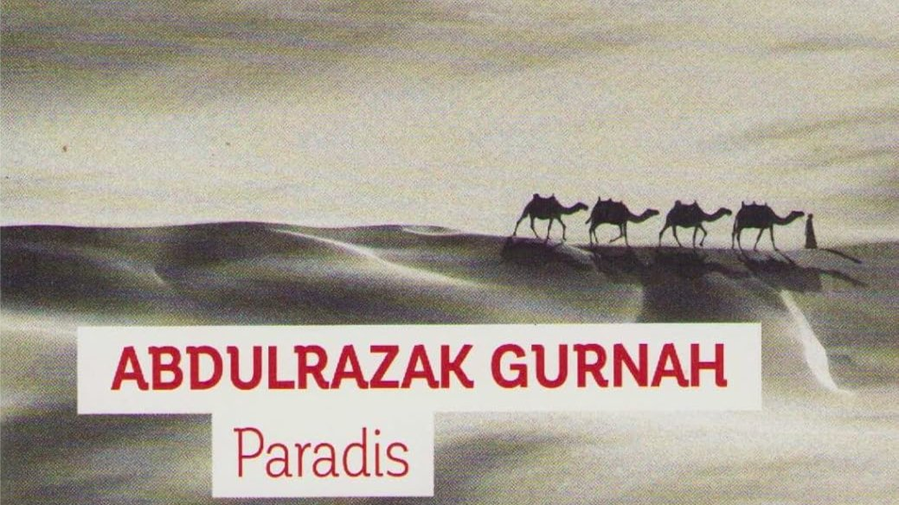

# Livre: Paradis

Édition: 49
Date l'événement: 2026-09-12
Lien: https://www.meetup.com/club-de-lecture-les-lectures-d-ailleurs/events/315554713/
Auteur: Abdulrazak Gurnah
Année: 2020
Pays: Tanzanie

## Description
Notre club de lecture se donne rendez-vous à la rentrée avec le roman *Paradis* d'Abdulrazak Gurnah, auteur tanzanien qui a reçu le prix Nobel de Littérature en 2021.

Quand ses parents annoncent à Yusuf, douze ans, qu'il va partir séjourner quelque temps chez son oncle Aziz, il est enchanté. Prendre le train, découvrir une grande ville, quel bonheur pour lui qui n'a jamais quitté son village de Tanzanie. Il ne comprend pas tout de suite que son père l'a vendu afin de rembourser une dette trop lourde - et qu'Aziz n'est pas son oncle, mais un riche marchand qui a besoin d'un esclave de plus chez lui. À travers les yeux de Yusuf, l'Afrique de l'Est au début du XXᵉ siècle, minée par la colonisation, se révèle dans toute sa beauté et sa rudesse. Dans ces étendues désertiques traversées de lentes caravanes, dans ce paradis bientôt perdu, le poids d'une vie vaut celui de quelques gouttes d'eau.

Merci d'avoir lu le livre avant la rencontre afin de partager vos impressions, sentiments et pensées. À la fin de la séance, nous choisirons collectivement la prochaine lecture et, pour ceux qui veulent, nous poursuivrons la discussion autour d’un petit dîner dans un restaurant.
