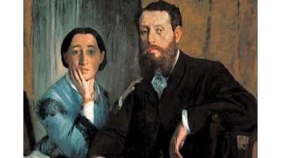

# Livre: Mon père et ma mère

Édition: 2
Date l'événement: 2022-04-02T17:00:00+02:00
Auteur: Aharon Appelfeld
Année: 2013
Pays: Israël

## Description
Pour la deuxième rencontre du groupe, nous découvrirons la littérature hébraïque avec un livre qui a gagné le Prix Inrockuptibles du roman étranger.
C'est l'été 1938 en Europe centrale. Et comme chaque année ils sont là, sur la rive, en villégiature.

Il y a Rosa Klein, qui lit dans les lignes de la main. Mais peut-on se fier à ses prédictions ? Et Karl Koenig, l'écrivain. Pourquoi fréquente-t-il les autres vacanciers au lieu de consacrer toute son énergie au roman qu'il est en train d'écrire ? Qui sont vraiment « l'homme à la jambe coupée » et la jeune femme amoureuse que tous les Juifs appellent par l'initiale de son prénom ? Et le père et la mère d'Erwin, l'enfant si sensible à l'anxiété de ceux qui l'entourent ?

Dans ce roman magistral publié quelques années avant sa mort, Aharon Appelfeld tisse les questions intimes, littéraires et métaphysiques qui l'ont accompagné toute sa vie. Sous sa plume, ces dernières vacances avant la guerre sont le moment où l'humanité se dévoile dans ses nuances les plus infimes, à l'approche de la catastrophe que tous redoutent sans parvenir à l'envisager.

https://www.placedeslibraires.fr/livre/9782757891308-mon-pere-et-ma-mere-aharon-appelfeld/

Merci d'avoir lu le livre avant la rencontre! Nous partagerons nos impressions, sentiments et pensées autour d'un café et, à la fin de la séance, nous choisirons collectivement la prochaine lecture.
