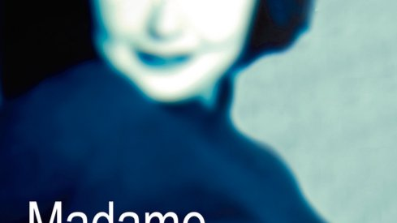

# Livre: Madame Hayat

Édition: 41
Date l'événement: 2025-11-15
Lien: https://www.meetup.com/club-de-lecture-les-lectures-d-ailleurs/events/311500309/
Auteur: Ahmet Altan
Année: 2021
Pays: Turquie

## Description
Pour notre rencontre de novembre, une découverte de la littérature turque: *Madame Hayat* de Ahmet Altan.

Fazil, le jeune narrateur de ce livre, part faire des études de lettres loin de chez lui. Devenu boursier après le décès de son père, il loge dans une modeste pension et gagne sa vie en tant que figurant dans une émission de télévision. C'est alors que sur un tournage, il remarque Madame Hayat, une femme voluptueuse qui pourrait être sa mère, dont il tombe éperdument amoureux. Quelques jours plus tard, il fait aussi la connaissance de la jeune Sila. Double bonheur, double initiation, double regard sur la magie d'une vie.
L'analyse tout en finesse du sentiment amoureux trouve en ce livre de singuliers échos. Le personnage de Madame Hayat, solaire, et celui de Fazil, plus littéraire, plus engagé, convoquent les subtiles métaphores d'une aspiration à la liberté absolue dans un pays qui se referme autour d'eux sans jamais parvenir à les atteindre.
Pour celui qui se souvient que ce livre a été écrit en prison, l'émotion est profonde.

Merci d'avoir lu le livre avant la rencontre afin de partager vos impressions, sentiments et pensées. À la fin de la séance, nous choisirons collectivement la prochaine lecture et pour, ceux qui veulent, nous poursuivrons la discussion autour d’un petit dîner dans un restaurant.
