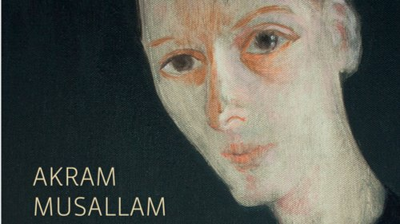

# Livre: La Cigogne

Édition: 23
Date l'événement: 2024-03-24T17:00:00+01:00
Auteur: Akram Musallam
Année: 2012
Pays: Palestine

## Description
Pour notre prochaine rencontre, découverte d'un auteur palestinien, Akram Musallam, et de son roman *La Cigogne*.

Dans un village de Palestine, un modeste enfant aux longues jambes grêles, aux épaules tombantes et au nez allongé se retrouve affublé par sa grand-mère d’un malencontreux sobriquet composé en arabe de deux segments identiques – «laqlaq» (“la cigogne”) –, sobriquet qui inoculera à l’enfant la manie d’en inverser les syllabes à l’infini. La vie du personnage sera à l’image de son nom : une suite absurde de séparations, de dislocations, de dédoublements, qui l’amèneront, comme un oiseau déboussolé, à ne plus savoir de quel côté de la ligne il se trouve.

Après «L’Histoire du scorpion qui ruisselait de sueur», où il creusait la métaphore du vide et de l’absence, Akram Musallam nous offre un nouvel opus subtilement mené, dans lequel, explorant la figure de la frontière, il s’attache à déconstruire les logiques spatiales de la domination. Avec une ironie mordante, qui n’est pas sans rappeler celle de son compatriote Émile Habibi dans« Les Aventures extraordinaires de Sa’îd le Peptimiste», il met à nu leurs effets sur la vie intime de gens paisibles et ordinaires – un grandpère attaché à ses oliviers et au souvenir des morts, une grandmère espiègle, une vieille voisine diseuse de bonne aventure, son fils arriviste – que rien ne destinait à faire face à de telles équivoques ni de tels imbroglios.

Merci d'avoir lu le livre avant la rencontre afin de partager vos impressions, sentiments et pensées. À la fin de la séance, nous choisirons collectivement la prochaine lecture et pour, ceux qui veulent, nous poursuivrons la discussion autour d’un petit dîner.
