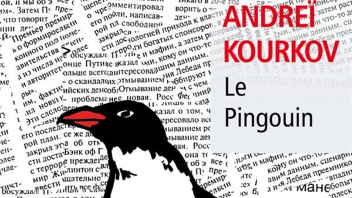

# Livre: Le pingouin

Édition: 4
Date l'événement: 2022-05-21
Lien: https://www.meetup.com/club-de-lecture-les-lectures-d-ailleurs/events/285626680/
Auteur: Andreï Kourkov
Année: 1996
Pays: Ukraine

## Description
Pour la quatrième rencontre, un roman culte de la littérature ukrainienne : *Le pingouin* d’Andreï Kourkov.
Pour tromper sa solitude, Victor Zolotarev a adopté un pingouin au zoo de Kiev en faillite. L'écrivain au chômage tente d'assurer leur subsistance tandis que l'animal déraciné traîne sa dépression entre la baignoire et le frigidaire vide. Alors, quand le rédacteur en chef d'un grand quotidien propose a\` Victor de travailler pour la rubrique nécrologie, celui-ci saute sur l'occasion. Un boulot tranquille et lucratif. Sauf qu'il s'agit de rédiger des notices sur des personnalités... encore en vie. Et qu'un beau jour, ces personnes se mettent à disparaître pour de bon.
Une plongée dans le monde impitoyable et absurde de l'ex-URSS.
https://www.placedeslibraires.fr/livre/9791034906109-le-pingouin-andrei-kourkov/
Merci d'avoir lu le livre avant la rencontre ! Nous partagerons nos impressions, sentiments et pensées autour d'un café et, à la fin de la séance, nous choisirons collectivement la prochaine lecture.
