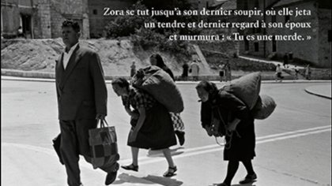

# Livre: Miracle à la Combe aux Aspics

Édition: 26
Date l'événement: 2024-06-22T17:00:00+02:00
Auteur: Ante Tomic
Année: 2009
Pays: Croatie

## Description
Pour notre prochaine rencontre, nous lisons le roman *Miracle à la Combe aux Aspics* d'Ante Tomic, afin de découvrir la littérature croate.

À sept kilomètres de Smiljevo, haut dans les montagnes, dans un hameau à l’abandon, vivent Jozo Aspic et ses quatre fils. Leur petite communauté aux habitudes sanitaires, alimentaires et sociologiques discutables n’admet ni l’État ni les fondements de la civilisation – jusqu’à ce que le fils aîné, Krešimir, en vienne à l’idée saugrenue de se trouver une femme.
Bientôt, il devient clair que la recherche d’une épouse est encore plus difficile et hasardeuse que la lutte quotidienne des Aspic pour la sauvegarde de leur autarcie.
La quête amoureuse du fils aîné des Aspic fait de ce *road-movie* littéraire une comédie hilarante, où les coups de théâtre s’associent pour accomplir un miracle à la Combe aux Aspics.

Merci d'avoir lu le livre avant la rencontre afin de partager vos impressions, sentiments et pensées. À la fin de la séance, nous choisirons collectivement la prochaine lecture et pour, ceux qui veulent, nous poursuivrons la discussion autour d’un petit dîner.
