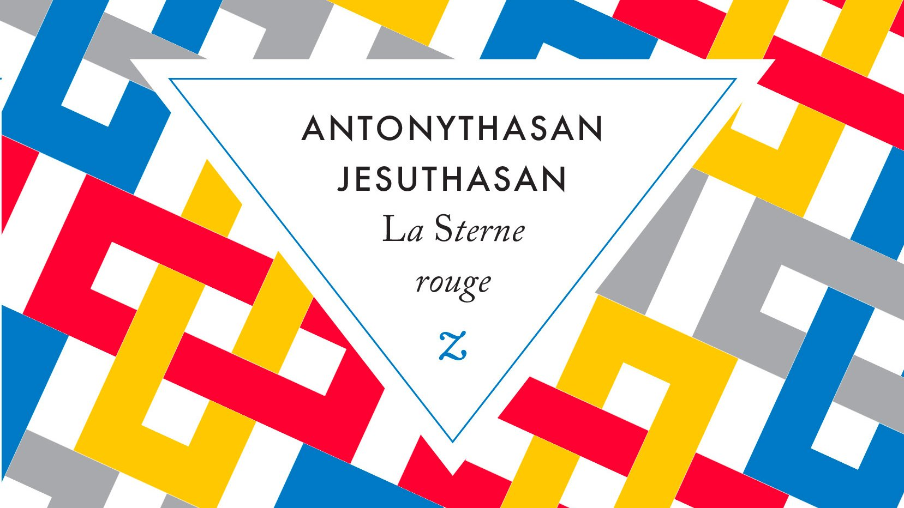

# Livre: La Sterne rouge

Édition: 25
Date l'événement: 2024-05-25
Lien: https://www.meetup.com/club-de-lecture-les-lectures-d-ailleurs/events/300538973/
Auteur: Antonythasan Jesuthasan
Année: 2022
Pays: Sri Lanka

## Description
Pour notre prochaine rencontre, nous aurons le plaisir de découvrir la littérature srilankaise avec le roman *La Sterne rouge* d'Antonythasan Jesuthasan.

Ala voit le jour dans la communauté tamoule d'un village du Sri Lanka en proie aux assauts de groupes paramilitaires cinghalais. Exposée aux conflits interethniques, elle est encore une enfant lorsqu'elle rejoint les Tigres tamouls.À quinze ans, amoureuse de son général, la voici prête à mourir au combat.

Mais l'attentat-suicide qu'elle s'apprête à commettre n'aura pas lieu et quand on lui ordonne de se faire sauter sans dommage collatéral, Ala rejette cette mort inutile et se fait arrêter. Condamnée à trois cents ans de prison par l'armée srilankaise, elle est libérée cinq ans plus tard. Ala n'a d'autre choix que l'exil, et file pour l'Europe. Là, une autre vie commence.
Mais Ala est-elle vraiment ce qu'elle prétend être ? Par une astucieuse mise en abyme, le roman explore avec subtilité la question des origines, de l'engagement, de la violence et de la liberté : comment à quinze ans se retrouve-t-on à commettre un attentat-suicide ? Quel jugement une kamikaze porte-t-elle sur la mort ? Quel retour possible vers la société civile ? Quel regard sur l'Europe ?
La Sterne rouge est aussi un magnifique roman dédié aux Tamouls de l'est du Sri Lanka, à leur savoir, leurs dieux et leurs démons, leur sorcellerie, leur théâtre - une culture effacée par la colonisation, que l'auteur s'attache à sortir de l'oubli.

Merci d'avoir lu le livre avant la rencontre afin de partager vos impressions, sentiments et pensées. À la fin de la séance, nous choisirons collectivement la prochaine lecture et pour, ceux qui veulent, nous poursuivrons la discussion autour d’un petit dîner.
