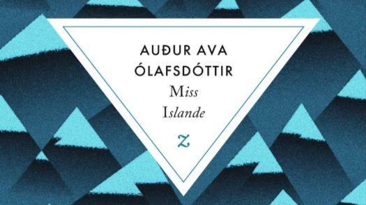

# Livre: Miss Islande

Édition: 11
Date l'événement: 2023-01-14T17:00:00+01:00
Auteur: Auður Ava Ólafsdóttir
Année: 2018
Pays: Islande

## Description
En cette fin d’année polaire et pour notre première rencontre de 2023, je vous propose un voyage en Islande avec un roman féministe qui a reçu le Prix Médicis étranger 2019 : Miss Islande de Auður Ava Ólafsdóttir.

Islande, 1963. Hekla, vingt et un ans, quitte la ferme de ses parents et prend le car pour Reykjavík. Il est temps d'accomplir son destin : elle sera écrivain. Sauf qu'à la capitale, on la verrait plutôt briguer le titre de Miss Islande.
Avec son prénom de volcan, Hekla bouillonne d'énergie créatrice, entraînant avec elle Ísey, l'amie d'enfance qui s'évade par les mots - ceux qu'on dit et ceux qu'on ne dit pas -, et son cher Jón John, qui rêve de stylisme entre deux campagnes de pêche...
Miss Islande est le roman, féministe et insolent, de ces pionniers qui ne tiennent pas dans les cases. Un magnifique roman sur la liberté, la création et l'accomplissement.

https://www.placedeslibraires.fr/livre/9791038701090-miss-islande-audur-ava-olafsd-ttir/

Merci d'avoir lu le livre avant la rencontre afin de partager vos impressions, sentiments et pensées. À la fin de la séance, nous choisirons collectivement la prochaine lecture et pour, ceux qui veulent, nous poursuivrons la discussion autour d’un petit dîner.
