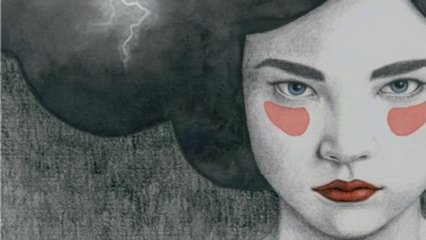

# Livre: Une ville à soi

Édition: 16
Date l'événement: 2023-06-17T17:00:00+02:00
Auteur: Chi Li
Année: 2011
Pays: Chine

## Description
Pour la prochaine rencontre, voyage en Chine avec le roman *Une ville à soi* de Chi Li, l'auteure la plus représentative du courant néoréaliste chinois.

Mijie, soutenue par sa belle-mère, tient d'une main de fer une minuscule boutique de cirage où défile tout le quartier. L'arrivée inattendue parmi les employées de la jeune Fengchun vient troubler sa routine et son aplomb. Une complicité empreinte de respect et d'affection se noue entre ces trois femmes ayant su rebondir et composer avec les règles d'une société qui ne leur accorde qu'une infime marge de liberté.
Hommage à la ville de Wuhan, ce roman explore quelques-unes des interrogations des femmes chinoises dans une négociation permanente entre éthique et recherche du bonheur personnel. Et c’est aussi à travers leur vie, leurs liens et leurs engagements, un portrait sensible de l’évolution des modes de vie urbains en Chine.

https://www.placedeslibraires.fr/livre/9782330114169-une-ville-a-soi-chi-li/

Merci d'avoir lu le livre avant la rencontre afin de partager vos impressions, sentiments et pensées. À la fin de la séance, nous choisirons collectivement la prochaine lecture et pour, ceux qui veulent, nous poursuivrons la discussion autour d’un petit dîner.
