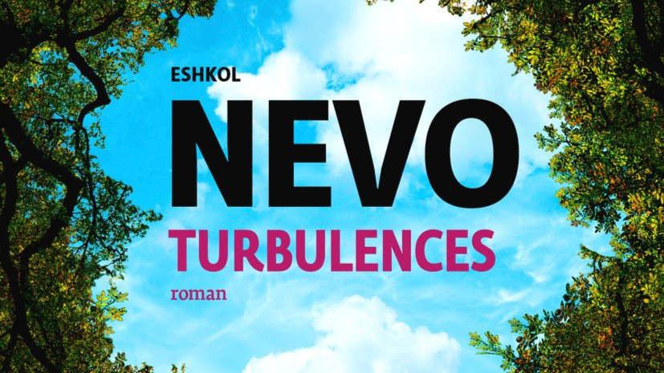

# Livre: Turbulences

Édition: 24
Date l'événement: 2024-04-20
Lien: https://www.meetup.com/club-de-lecture-les-lectures-d-ailleurs/events/299993979/
Auteur: Eshkol Nevo
Année: 2015
Pays: Israël

## Description
Pour notre rencontre d'avril, on reste sur le Moyen-Orient avec le roman *Turbulences* de l'auteur israélien Eshkol Nevo.

Une lune de miel en Amérique du Sud tourne au cauchemar. Un médecin-chef d’un hôpital de Tel-Aviv se sent étrangement proche d’une jeune femme de son service jusqu’à éprouver le besoin impérieux de la protéger. Un couple marié a pour habitude de se promener le samedi matin dans un verger à la périphérie de la ville, mais lorsque l’homme entre pour un instant dans le jardin, il disparaît sans laisser de traces.
Trois histoires d’amour turbulentes et non conventionnelles s’entrecroisent et nous plongent dans l’énigme qui se trouve au cœur de toute intimité. Sans délaisser l’ironie si caractéristique de son écriture, Eshkol Nevo fouille les relations humaines en utilisant habilement les mécanismes du thriller.

Merci d'avoir lu le livre avant la rencontre afin de partager vos impressions, sentiments et pensées. À la fin de la séance, nous choisirons collectivement la prochaine lecture et pour, ceux qui veulent, nous poursuivrons la discussion autour d’un petit dîner.
