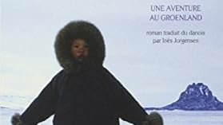

# Livre: Imaqa : Une aventure au Groenland

Édition: 43
Date l'événement: 2026-01-10T17:00:00+01:00
Auteur: Flemming Jensen
Année: 1999
Pays: Danemark

## Description
Nous nous retrouvons en 2026 autour du roman *Imaqa : Une aventure au Groenland* de l'auteur Danois Flemming Jensen.

Martin, instituteur danois de trente-huit ans qui ressent un vide dans son existence, demande sa mutation dans la province la plus septentrionale du Danemark, le Groenland. Il prend ses fonctions dans un hameau de cent cinquante âmes: Nunaqarfik, à plus de cinq cents kilomètres au nord du cercle polaire.
Armé de ses bonnes intentions, encombré de sa mauvaise conscience coloniale et de ses idées préconçues, Martin découvre une communauté solidaire, dont la vie s'organise en fonction de la nature environnante - et pas malgré elle. Au fil des mois qui passent et des rencontres, dans une société où le rire est érigé en remède suprême contre la peur ou la tristesse, il apprend à apprécier ce qui est, sans se soucier de ce qui aurait pu être, et trouve ce à quoi il aspirait : l'aventure, l'immensité, l'harmonie, l'amour.
Roman chaleureux et humaniste, qui dénonce notamment les ravages de la colonisation du Groenland par le Danemark, Imaqa est un hymne à la tolérance et à la douceur, porté par un humour irrésistible.

Merci d'avoir lu le livre avant la rencontre afin de partager vos impressions, sentiments et pensées. À la fin de la séance, nous choisirons collectivement la prochaine lecture et pour, ceux qui veulent, nous poursuivrons la discussion autour d’un petit dîner dans un restaurant.
