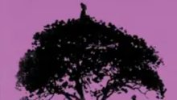

# Livre: Jacaranda

Édition: 35
Date l'événement: 2025-04-12
Lien: https://www.meetup.com/club-de-lecture-les-lectures-d-ailleurs/events/306621308/
Auteur: Gaël Faye
Année: 2024
Pays: Rwanda

## Description
Pour notre prochaine rencontre, nous lirons *Jacaranda* de l'auteur franco-rwandais Gaël Faye, roman qui a obtenu le prix Renaudot 2024.

Quels secrets cache l’ombre du jacaranda, l’arbre fétiche de Stella ? Il faudra à son ami Milan des années pour le découvrir. Des années pour percer les silences du Rwanda, dévasté après le génocide des Tutsi. En rendant leur parole aux disparus, les jeunes gens échapperont à la solitude. Et trouveront la paix près des rivages magnifiques du lac Kivu.

Sur quatre générations, avec sa douceur unique, Gaël Faye nous raconte l’histoire terrible d’un pays qui s’essaie malgré tout au dialogue et au pardon. Comme un arbre se dresse entre ténèbres et lumière, *Jacaranda* célèbre l’humanité, paradoxale, aimante, vivante.

Merci d'avoir lu le livre avant la rencontre afin de partager vos impressions, sentiments et pensées. À la fin de la séance, nous choisirons collectivement la prochaine lecture et pour, ceux qui veulent, nous poursuivrons la discussion autour d’un petit dîner dans un restaurant.
