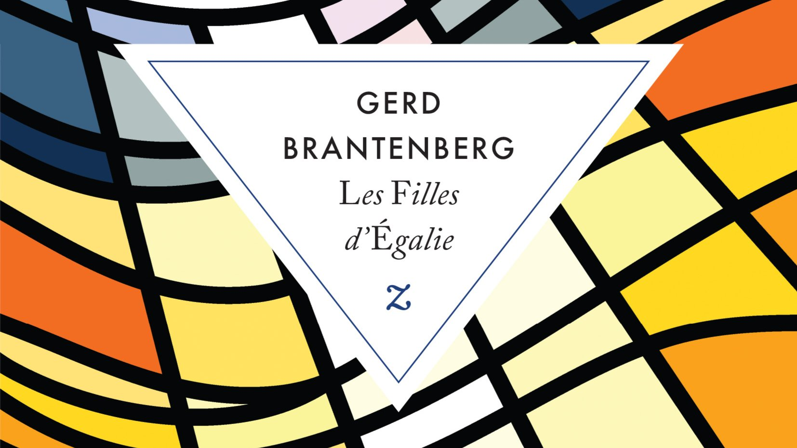

# Livre: Les Filles d’Égalie

Édition: 39
Date l'événement: 2025-09-13
Lien: https://www.meetup.com/club-de-lecture-les-lectures-d-ailleurs/events/308926043/
Auteur: Gerd Brantenberg
Année: 1977
Pays: Norvège

## Description
Notre club de lecture se retrouvera pour une nouvelle saison en septembre avec *Les Filles d’Égalie*, roman féministe écrit en 1977 par l'auteure Norvégienne Gerd Brantenberg.

« Elle » fait bon vivre en Égalie. La présidente Rut Brame travaille nuit et jour à la bonne marche de l’État, quand son époux Kristoffer veille avec amour sur leur foyer. Il y règne d’ailleurs une effervescence toute particulière : à quinze ans, leur fils Pétronius s’apprête à faire son entrée dans le monde. Car voici enfin venu le bal des débutants.
Mais l’adolescent, grand et maigre, loin des critères de beauté, s’insurge contre sa condition d’homme-objet. Dans l’impossibilité de prendre son indépendance, il crée presque malgré lui un mouvement qui s’apprête à renverser le pouvoir matriarcal en place. L’avenir de la cité radieuse est amené à changer... pour le meilleur et pour le pire.

Avec *Les Filles d’Égalie*, Gerd Brantenberg signe une utopie féministe et résolument provocatrice. Elle renverse littéralement les codes de la société patriarcale : les femmes ont tous les pouvoirs, et la langue s’en ressent. Le féminin, omniprésent, l’emporte systématiquement sur le masculin, faisant apparaître de nouveaux mots qui soulignent avec une ironie mordante l’oppression invisible qui règne sur les femmes d’aujourd’hui. Brûlant d’actualité et débordant d’humour, *Les Filles d’Égalie*, le grand roman féministe norvégien du XXe siècle.

Merci d'avoir lu le livre avant la rencontre afin de partager vos impressions, sentiments et pensées. À la fin de la séance, nous choisirons collectivement la prochaine lecture et pour, ceux qui veulent, nous poursuivrons la discussion autour d’un petit dîner dans un restaurant.
