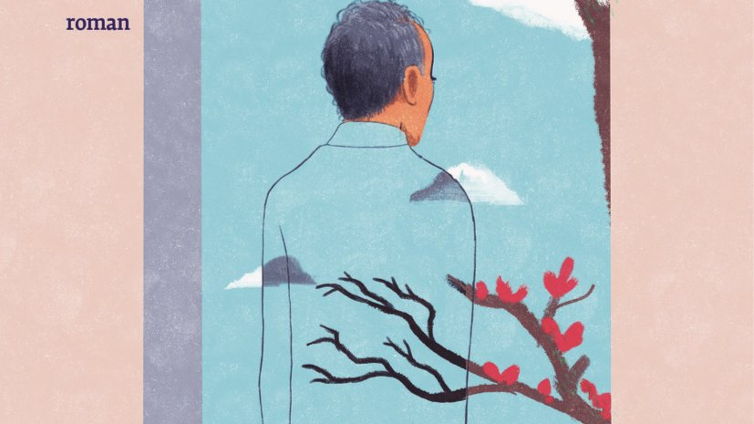

# Livre: Le jardinier et la mort

Édition: 42
Date l'événement: 2025-12-06
Lien: https://www.meetup.com/club-de-lecture-les-lectures-d-ailleurs/events/312032905/
Auteur: Guéorgui Gospodinov
Année: 2024
Pays: Bulgarie

## Description
Pour notre dernière rencontre de l'année, nous découvrirons le grand auteur Bulgare Guéorgui Gospodinov et sa dernière oeuvre: *Le jardinier et la mort*.

C’est l’histoire d’un jardinier en Bulgarie, un homme né à la fin de la Seconde Guerre mondiale, qui avait connu le communisme puis son effondrement. Un homme qui soignait son potager avec constance, qui guettait les bourgeons sur le point d’éclore, qui détachait délicatement des feuilles de menthe verte pour les disposer sur des tranches de tomates cueillies de sa main.

Cet homme était le père du narrateur, qui vit un immense chagrin au moment de se retrouver orphelin. Comment dire à son père l’amour qu’on lui porte ? Comment devenir à son tour celui qui raconte les histoires et fait poindre de nouvelles racines ?
Avec ce livre très attendu après *Le pays du passé*, Guéorgui Gospodinov nous invite à écouter la musique silencieuse de la pudeur des sentiments paternels et à observer quels sont les trésors véritables que l’on peut transmettre à son fils. Le grand écrivain bulgare nous offre le portrait délicat d’une relation à la fois unique et universelle, où les mots entrelacent l’amour et le souvenir, et continueront, comme les fleurs, de renaître à chaque printemps.

Merci d'avoir lu le livre avant la rencontre afin de partager vos impressions, sentiments et pensées. À la fin de la séance, nous choisirons collectivement la prochaine lecture et pour, ceux qui veulent, nous poursuivrons la discussion autour d’un petit dîner dans un restaurant.
