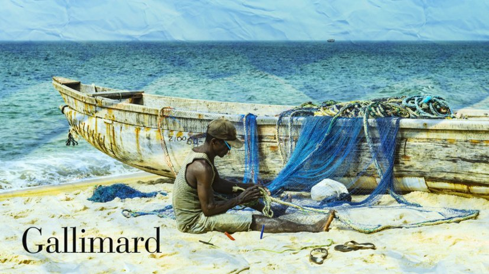

# Livre: Le rêve du pêcheur

Édition: 28
Date l'événement: 2024-09-07
Lien: https://www.meetup.com/club-de-lecture-les-lectures-d-ailleurs/events/302364002/
Auteur: Hemley Boum
Année: 2024
Pays: Cameroun

## Description
Pour la rencontre de la rentrée, nous lisons exceptionnellement un roman écrit en français afin de découvrir la littérature camerounaise: *Le rêve du pêcheur* de Hemley Boum.

Zack a fui le Cameroun à dix-huit ans, abandonnant sa mère, Dorothée, à son sort et à ses secrets. Devenu psychologue clinicien à Paris, marié et père de famille, il est rattrapé par le passé alors que la vie qu’il s’est construite prend l’eau de toutes parts... À quelques décennies de là, son grand-père Zacharias, pêcheur dans un petit village côtier, voit son mode de vie traditionnel bouleversé par une importante compagnie forestière. Il rêve d’un autre avenir pour les siens…

Avec ces deux histoires savamment entrelacées, Hemley Boum signe une fresque puissante et lumineuse qui éclaire à la fois les replis de la conscience et les mystères de la transmission.

Merci d'avoir lu le livre avant la rencontre afin de partager vos impressions, sentiments et pensées. À la fin de la séance, nous choisirons collectivement la prochaine lecture et pour, ceux qui veulent, nous poursuivrons la discussion autour d’un petit dîner.
