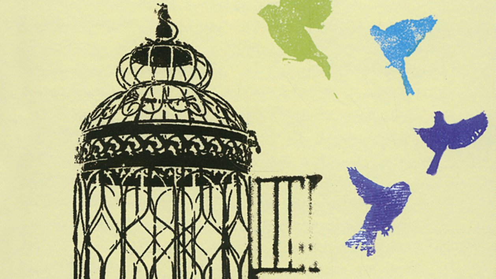

# Livre: Animal du cœur

Édition: 38
Date l'événement: 2025-07-05T17:00:00+02:00
Auteur: Herta Müller
Année: 1994
Pays: Allemagne

## Description
Pour notre dernière rencontre estivale, nous découvrirons l'oeuvre d'Herta Müller, écrivaine allemande d'origine roumaine qui a reçu le prix Nobel de littérature en 2009.

Lola a quitté sa province pour échapper à la misère et faire ses études à Timisoara. Un jour, on la retrouve pendue dans son placard. À cette mort misérable s’ajoute son exclusion infamante, à titre posthume, du Parti communiste. La narratrice, ancienne camarade de chambre de Lola, ne croit pas à la thèse du suicide, pas plus qu’Edgar, Kurt et Georg. Mais l’amitié qui se noue entre elle et les trois garçons, puis avec Tereza, est menacée par cette société qui broie les individus.

*Animal du cœur* dépeint le régime de terreur de Ceausescu et ses conséquences sur de très jeunes vies. L’auteur y interroge, dans une langue d’une richesse poétique inouïe, la capacité de l’homme à sauver son humanité profonde.

Merci d'avoir lu le livre avant la rencontre afin de partager vos impressions, sentiments et pensées. À la fin de la séance, nous choisirons collectivement la prochaine lecture et pour, ceux qui veulent, nous poursuivrons la discussion autour d’un petit dîner dans un restaurant.
