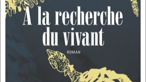

# Livre: À la recherche du vivant

Édition: 46
Date l'événement: 2026-05-02T17:00:00+02:00
Auteur: Iida Turpeinen
Année: 2023
Pays: Finlande

## Description
Pour notre prochaine rencontre, une découverte de la littérature finlandaise : *À la recherche du vivant* de la jeune auteure Iida Turpeinen.

En 1741, le naturaliste Georg Wilhelm Steller rejoint la Grande Expédition du Nord. Cette mission d’exploration et de recherche scientifique, menée par le capitaine Vitus Béring, a pour objectif d’ouvrir une route maritime entre l’Asie et l’Amérique. Les navires partis de Russie n’atteindront jamais le continent américain, mais Steller fera une découverte singulière : une nouvelle espèce de grand mammifère marin, connue aujourd’hui sous le nom de « rhytine de Steller ». Chassée pour sa viande, la rhytine disparaît en moins de trois décennies, et devient dès lors un objet de fascination.
Épopée passionnante, *À la recherche du vivant* nous fait traverser les siècles dans le sillage de la rhytine de Steller, mais aussi des hommes et des femmes dont le destin a été mêlé à celui de cette extraordinaire créature. Entre roman d’aventures, histoire coloniale, des découvertes et des sciences, et réflexion quant à l’impact de l’homme sur son environnement, Iida Turpeinen nous embarque dans un récit enlevé dont elle déploie avec originalité les multiples facettes pour, *in fine*, éclairer notre humanité et notre rapport au vivant.

Merci d'avoir lu le livre avant la rencontre afin de partager vos impressions, sentiments et pensées. À la fin de la séance, nous choisirons collectivement la prochaine lecture et pour, ceux qui veulent, nous poursuivrons la discussion autour d’un petit dîner dans un restaurant.
