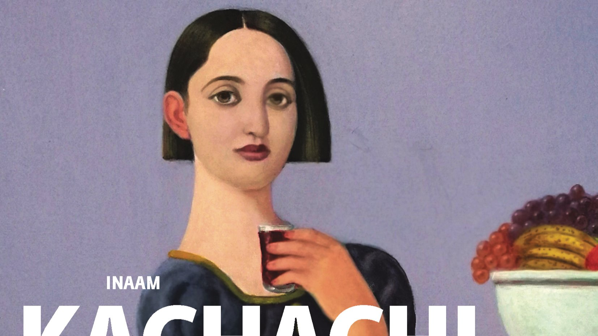

# Livre: L'Indésirable

Édition: 32
Date l'événement: 2025-01-11
Lien: https://www.meetup.com/club-de-lecture-les-lectures-d-ailleurs/events/304981113/
Auteur: Inaam Kachachi
Année: 2017
Pays: Irak

## Description
Nous accueillons 2025 avec une découverte de la littérature irakienne, avec *L'Indésirable* d'Inaam Kachachi.

Taj Al-Moulouk et Widiane sont liées par la mémoire d’un pays, l’Irak. Forcées de s’exiler pour survivre, les deux femmes, qui appartiennent pourtant à des générations différentes, sont devenues amies à Paris, leur terre d’accueil. Une même question les hante : comment accepter le déracinement, la perte du pays qui les a vues naître ? Pour l’une en racontant le passé, pour l’autre en le taisant à tout jamais. Au gré de leurs récits entremêlés se dessine un portrait nuancé de l’Irak du siècle dernier.
Mélancolique ode à un pays englouti par la violence du XXᵉ siècle, ce roman nous emporte dans les puissants souvenirs de ces femmes libres.

Merci d'avoir lu le livre avant la rencontre afin de partager vos impressions, sentiments et pensées. À la fin de la séance, nous choisirons collectivement la prochaine lecture et pour, ceux qui veulent, nous poursuivrons la discussion autour d’un petit dîner dans un restaurant.
