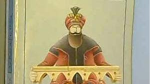

# Livre: Le Pont sur la Drina

Édition: 47
Date l'événement: 2026-06-06
Lien: https://www.meetup.com/club-de-lecture-les-lectures-d-ailleurs/events/314606570/
Auteur: Ivo Andric
Année: 1945
Pays: Bosnie-Herzégovine

## Description
Pour notre rencontre de juin, nous lisons l'oeuvre du l'auteur yougoslave Ivo Andric, prix Nobel de littérature en 1961, *Le Pont sur la Drina*.

A Visegrad, c'est sur le pont reliant les deux rives de la Drina - mais aussi la Serbie et la Bosnie, l'Orient et l'Occident - que se concentre depuis le XVIe siècle la vie des habitants, chrétiens, juifs, musulmans de Turquie ou " islamisés ". C'est là que l'on palabre, s'affronte, joue aux cartes, écoute les proclamations des maîtres successifs du pays, Ottomans puis Austro-Hongrois.
C'est la chronique de ces quatre siècles que le grand romancier yougoslave Ivo Andriécï, prix Nobel de littérature en 1961, nous rapporte ici, mêlant la légende à l'histoire, la drôlerie à l'horreur, faisant revivre mille et un personnages : de Radisav le Serbe empalé par le gouverneur turc, à Fata qui se jette du pont pour éviter un mariage forcé, et au vieil Ali Hodja, le Turc traditionaliste, qui voit avec consternation surgir les troupes de l'empereur François-Joseph.
En 1914, le pont endommagé dans une explosion demeure debout. Sinistre présage, cependant, grâce auquel ce roman paru en 1945, oeuvre d'un écrivain bosniaque par sa naissance, croate par son origine et serbe par ses engagements d'alors, nous paraît aujourd'hui mystérieusement prophétique.

Merci d'avoir lu le livre avant la rencontre afin de partager vos impressions, sentiments et pensées. À la fin de la séance, nous choisirons collectivement la prochaine lecture et pour, ceux qui veulent, nous poursuivrons la discussion autour d’un petit dîner dans un restaurant.
