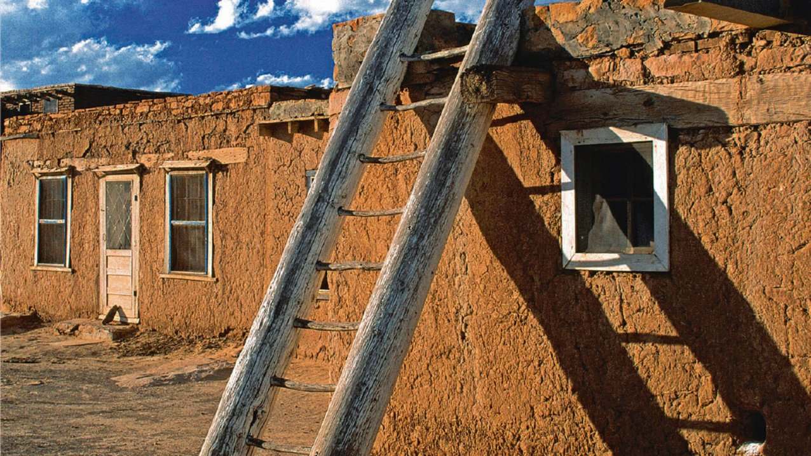

# Livre: Pedro Páramo

Édition: 30
Date l'événement: 2024-11-02
Lien: https://www.meetup.com/club-de-lecture-les-lectures-d-ailleurs/events/303860123/
Auteur: Juan Ruflo
Année: 1955
Pays: Mexique

## Description
Pour notre rencontre de novembre (et à l’occasion de la fête des morts, par ailleurs), nous découvrirons la littérature mexicaine avec un grand classique : *Pedro Páramo* de Juan Ruflo.

On l’a lu d’abord comme un roman «rural» et «paysan», voire comme un exemple de la meilleure littérature «indigéniste». Dans les années soixante et soixante-dix, il est devenu un grand roman «mexicain», puis «latino-américain». Aujourd’hui, on dit que *Pedro Páramo* est, tout simplement, l’une des plus grandes œuvres du XXᵉ siècle, un classique contemporain que la critique compare souvent au *Château* de Kafka et au *Bruit et la fureur* de Faulkner.

Et pour cause : personne ne sort indemne de la lecture de *Pedro Páramo*. Tout comme Kafka et Faulkner, Rulfo a su mettre en scène une histoire fascinante, sans âge et d’une beauté rare : la quête du père qui mène Juan Preciado à Cómala et à la rencontre de son destin, un voyage vertigineux raconté par un chœur de personnages insolites qui nous donnent à entendre la voix profonde du Mexique, au-delà des frontières entre la mémoire et l’oubli, le passé et le présent, les morts et les vivants.

Merci d'avoir lu le livre avant la rencontre afin de partager vos impressions, sentiments et pensées. À la fin de la séance, nous choisirons collectivement la prochaine lecture et pour, ceux qui veulent, nous poursuivrons la discussion autour d’un petit dîner dans un restaurant mexicain.
