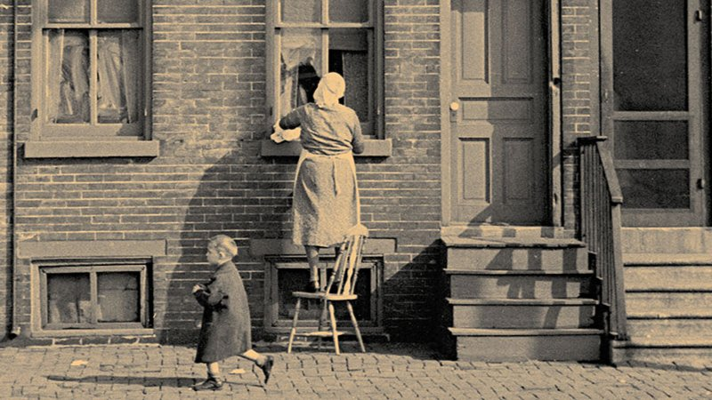

# Livre: Sillages

Édition: 13
Date l'événement: 2023-03-18T17:00:00+01:00
Auteur: Kallia Papadaki
Année: 2015
Pays: Grèce

## Description
Pour le premier anniversaire de notre club de lecture, nous découvrirons une nouvelle plume de la littérature grecque qui, malgré les idées reçues, ne s'est pas arrêtée à l'antiquité: Sillages de Kallia Papadaki.

Quand la mère de Minnie, douze ans, meurt de chagrin après la disparition de son fils, la fillette est recueillie par la famille Kambanis. Susanne, la mère, une ex-hippie, Basil, le beau-père, américano-grec de la deuxième génération et Lito, fille unique, la prennent sous leur aile.

Si elle les rapproche un temps, l’arrivée de Minnie fait cependant ressurgir de vieilles blessures familiales qu’il va s’agir de panser. De l’arrivée du grand-père à Camden (New Jersey) au début du XXe siècle, jusqu’au milieu des années 1980, Kallia Papadaki retrace la trajectoire des familles grecques immigrées aux États-Unis en une bouleversante et captivante saga familiale.
Entre rêve américain et espoirs déçus, difficultés présentes et nostalgie des origines, apparaît une véritable solidarité entre communautés, généreuses et joyeuses par moments, plus mélancoliques à d’autres. Mais toujours animées par une fascinante force de vie.

https://www.placedeslibraires.fr/livre/9782366243932-sillages-kallia-papadaki/

Merci d'avoir lu le livre avant la rencontre afin de partager vos impressions, sentiments et pensées. À la fin de la séance, nous choisirons collectivement la prochaine lecture et pour, ceux qui veulent, nous poursuivrons la discussion autour d’un petit dîner.
