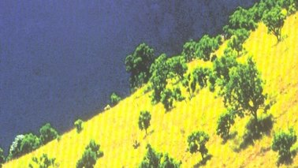

# Livre: Retour au pays bien-aimé

Édition: 12
Date l'événement: 2023-02-18
Lien: https://www.meetup.com/club-de-lecture-les-lectures-d-ailleurs/events/290945129/
Auteur: Karel Schoeman
Année: 1972
Pays: Afrique du Sud

## Description
Pour notre prochaine rencontre, découverte de la littérature sud-africaine, avec un roman écrit en langue afrikaans, celle des anciens colons d'origine néerlandaise: Retour au pays bien-aimé de Karel Schoeman.

George Neethling, la trentaine, retourne en Afrique du Sud, pays qu'il avait quitté enfant. Sa mère vient de mourir. Il quitte la Suisse, où il réside, afin de vendre Rietvlei, la propriété où sa mère est née. Rietvlei se trouve loin de toute ville. Neethling sera hébergé par un couple de fermiers, les Hattingh et leurs enfants ( trois garçons : Johannes, Hendrik et Paul, et une fille : Clara ). Pendant quelques jours Neethling va vivre à leur rythme, les écoutant évoquer sa mère, le passé, l'histoire de l'Afrique du Sud, mais aussi exprimer la terreur que leur inspirent les sempiternelles rondes des militaires, tous des pilleurs et des assassins. Nous sommes encore au temps de l'Apartheid. Clara, tour à tour hostile et amicale à son égard, le mènera là où autrefois s'élevait Rietvlei, aujourd'hui un tas de ruines, conséquence d'affrontements entre l'armée et des opposants au régime. Neethling comprendra soudain qu'il ne trouvera jamais sa place dans son pays d'origine voué désormais au chaos.

Livre puissant, qui fait songer à un grand fleuve plein de remous et de tourbillons, Retour au pays bien aimé est sans aucun doute le roman de Karel Schoeman où les sentiments de peur et de colère sont les plus omniprésents. Comme nul autre, Schoeman parle aussi du silence avec une douceur toute musicale et infiniment poétique, mais cette douceur-là, nous nous apercevons peu à peu, qu'elle est terriblement trompeuse.

https://www.placedeslibraires.fr/livre/9782752902078-retour-au-pays-bien-aime-karel-schoeman/

Merci d'avoir lu le livre avant la rencontre afin de partager vos impressions, sentiments et pensées. À la fin de la séance, nous choisirons collectivement la prochaine lecture et pour, ceux qui veulent, nous poursuivrons la discussion autour d’un petit dîner.
