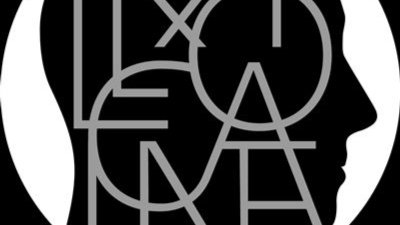

# Livre: Kallocaïne

Édition: 33
Date l'événement: 2025-02-08T17:00:00+01:00
Auteur: Karin Boye
Année: 1940
Pays: Suède

## Description
Pour notre prochaine rencontre, nous lirons un roman dystopique suédois publié en 1940: *Kallocaïne* de Karin Boye.

Dans une société où la surveillance de tous, sous l'oeil vigilant de la police, est l'affaire de chacun, le chimiste Leo Kall met au point un sérum de vérité qui offre à l'État Mondial l'outil de contrôle total qui lui manquait. En privant l'individu de son dernier jardin secret, la kallocaïne permet de débusquer les rêves de liberté que continuent d'entretenir de rares citoyens. Elle permettra également à son inventeur de surmonter, au prix d'un viol psychique, une crise personnelle qui lui fera remettre en cause nombre de ses certitudes. Et si le rêve des derniers résistants, une mystérieuse cité fondée sur la confiance, n'en était pas un ? Kallocaïne est le chaînon manquant entre Fahrenheit 451, Le meilleur des mondes et 1984. Dès 1940, la dystopie visionnaire de Karin Boye interroge les limites, s'il y en a, du contrôle que peut exercer un État totalitaire sur ses citoyens.

Merci d'avoir lu le livre avant la rencontre afin de partager vos impressions, sentiments et pensées. À la fin de la séance, nous choisirons collectivement la prochaine lecture et pour, ceux qui veulent, nous poursuivrons la discussion autour d’un petit dîner dans un restaurant.
