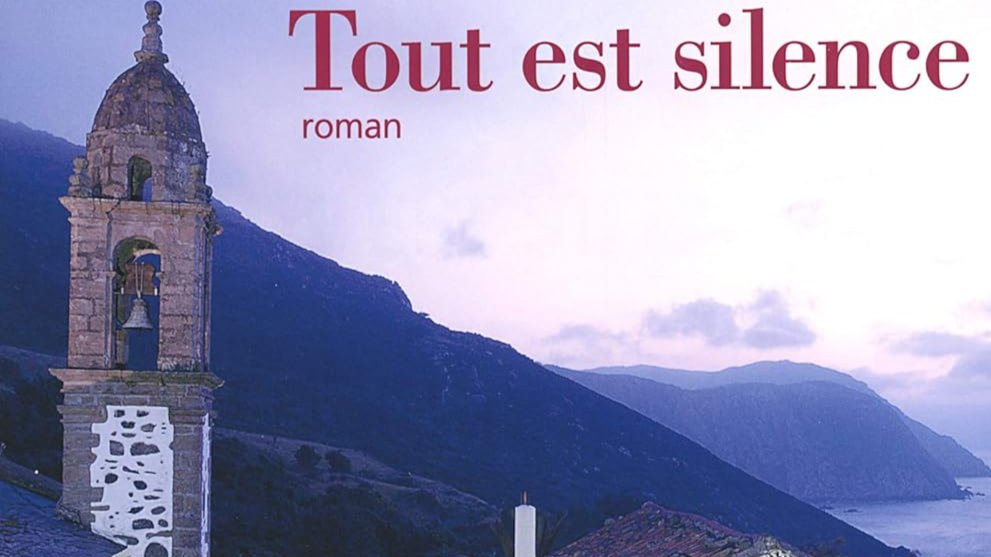

# Livre: Tout est silence

Édition: 22
Date l'événement: 2024-02-24T17:00:00+01:00
Auteur: Manuel Rivas
Année: 2010
Pays: Espagne

## Description
Pour notre prochaine rencontre, direction l'Espagne, et plus particulièrement la Galice, avec le roman *Tout est silence* de Manuel Rivas.

Au nord de l'Espagne, sur la côte galicienne, la contrebande est pratique courante chez les pêcheurs depuis le Moyen Âge. Mais quand le petit village de Noitía se transforme en l'un des centres les plus importants du trafic mondial de drogue, on change brutalement d'échelle, de langage et de coutumes. Désormais l'argent, l'amour et la mort n'ont plus le même sens ni les mêmes dimensions. Manuel Rivas nous raconte ici ce bouleversement qui marque l'écart entre deux générations. Adolescents, Fins, Leda et Brinco comprennent que leur village est régi par la seule loi que fixe Monsieur Mariscal mais que les temps sont en train de changer. Alors que Leda et Brinco rejoignent son bord et deviennent de riches trafiquants, Fins, à l'opposé, entre dans la police judiciaire et n'aura de cesse de les traquer, comme s'il courait secrètement derrière son ombre la plus obscure et sur les traces de son bonheur perdu. Dès lors, leurs trois destins seront définitivement liés à l'évolution de la Galice dans ce monde global : en trente ans, ce qui n'était qu'une bande de contrebandiers se transformera en une mafia implacable, les vieilles barques deviendront des bateaux ultrarapides, le tabac de la cocaïne et la petite délinquance se rapprochera nettement du grand crime mondialisé. Les rires, les cris, les conversations s'arrêtent un jour sur cette pointe extrême de l'Europe, car, quand à parler on joue sa vie, tout est silence...

Merci d'avoir lu le livre avant la rencontre afin de partager vos impressions, sentiments et pensées. À la fin de la séance, nous choisirons collectivement la prochaine lecture et pour, ceux qui veulent, nous poursuivrons la discussion autour d’un petit dîner.
