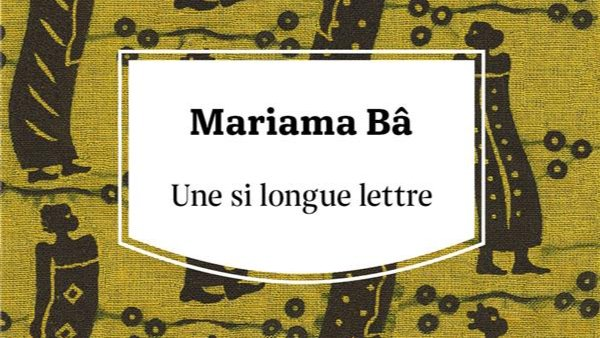

# Livre: Une si longue lettre

Édition: 19
Date l'événement: 2023-11-11
Lien: https://www.meetup.com/club-de-lecture-les-lectures-d-ailleurs/events/296734672/
Auteur: Mariama Bâ
Année: 1979
Pays: Sénégal

## Description
Pour notre prochain rendez-vous, nous lirons exceptionnellement un livre écrit en français, afin de découvrir la littérature sénégalaise : *Une si longue lettre* de Mariama Bâ.
Une si longue lettre est une oeuvre majeure, pour ce qu'elle dit de la condition des femmes. Au coeur de ce roman, la lettre que l'une d'elle, Ramatoulaye, adresse à sa meilleure amie, pendant la réclusion traditionnelle qui suit son veuvage.Elle y évoque leurs souvenirs heureux d'étudiantes impatientes de changer le monde, et cet espoir suscité par les Indépendances. Mais elle rappelle aussi les mariages forcés, l'absence de droits des femmes. Et tandis que sa belle-famille vient prestement reprendre les affaires du défunt, Ramatoulaye évoque alors avec douleur le jour où son mari prit une seconde épouse, plus jeune, ruinant vingt-cinq années de vie commune et d'amour.
La Sénégalaise Mariama Bâ est la première romancière africaine à décrire avec une telle lumière la place faite aux femmes dans sa société.

Merci d'avoir lu le livre avant la rencontre afin de partager vos impressions, sentiments et pensées. À la fin de la séance, nous choisirons collectivement la prochaine lecture et pour, ceux qui veulent, nous poursuivrons la discussion autour d’un petit dîner.
