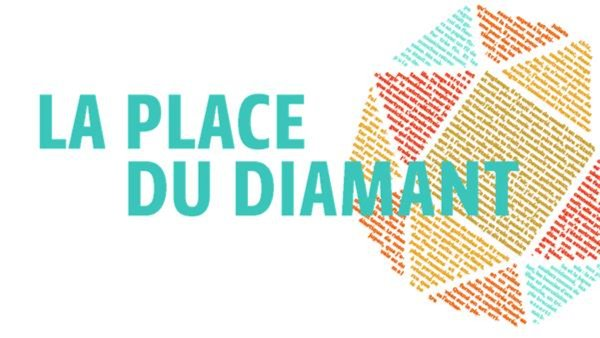

# Livre: La place du diamant

Édition: 3
Date l'événement: 2022-04-30
Lien: https://www.meetup.com/club-de-lecture-les-lectures-d-ailleurs/events/285023909/
Auteur: Mercè Rodoreda
Année: 1962
Pays: Espagne

## Description
Pour la troisième rencontre du groupe, nous avons choisi une oeuvre majeure de la littérature catalane, un récit saisissant d'une femme en quête de liberté en pleine guerre civile.

«Sans travail, sans rien en vue, j'ai fini de vendre ce qui me restait : mon lit de jeune fille, le matelas du lit aux colonnes, la montre de Quimet que je voulais donner à Antoni lorsqu'il serait grand. Tout le linge. Les coupes, les tasses, le buffet... Et quand il ne me restait rien en dehors de ces monnaies qui me semblaient sacrées, j'ai fait taire ma fierté et je suis allée chez mes anciens patrons.» Une Catalane, femme du peuple, originaire du quartier de Gràcia à Barcelone, raconte sa vie. Avec délicatesse et discrétion, Natàlia évoque son adolescence, le travail - elle est alors vendeuse dans une pâtisserie du quartier -, son mariage, les maternités, la mort de son mari, milicien dans l'armée républicaine, la guerre civile, la faim, le désespoir, son remariage...

Ce témoignage émouvant par la simplicité d'une vie banale en apparence, mais qui se déroule pendant une époque mouvementée, la guerre civile puis les années noires qui suivent la victoire du franquisme, est considéré comme le chef-d'oeuvre du roman catalan depuis un quart de siècle.

https://www.placedeslibraires.fr/livre/9782070779567-l-imaginaire-la-place-du-diamant-merce-rodoreda/

Merci d'avoir lu le livre avant la rencontre! Nous partagerons nos impressions, sentiments et pensées autour d'un café et, à la fin de la séance, nous choisirons collectivement la prochaine lecture.
