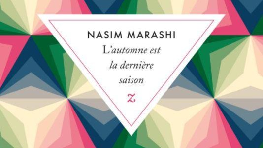

# Livre: L'automne est la dernière saison

Édition: 14
Date l'événement: 2023-04-22T17:00:00+02:00
Auteur: Nasim Marashi
Année: 2015
Pays: Iran

## Description
Pour la prochaine rencontre, voyage en Iran avec une auteure contemporaine et un véritable best-seller qui a remporté le prix Jalal Al Ahmad, l’un des prix les plus prestigieux dans son pays: L'automne est la dernière saison de Nasim Marashi.

Dans le brouhaha des rues agitées de Téhéran, Leyla, Shabaneh et Roja sont à l'heure des choix. Trois jeunes femmes diplômées, tiraillées entre les traditions, leur modernité et leurs désirs.

Leyla rêve de journalisme ou de devenir libraire. Son mari, pourtant aimant et attentionné, a émigré sans elle. A-t-elle eu raison de ne pas le suivre et de rester ? Shabaneh est courtisée par son collègue, qui voit en elle une épouse parfaite. Comment démêler si elle l'aime, si elle peut se résoudre à abandonner son frère handicapé, alors qu'elle en est l'unique protection ? Roja, la plus ambitieuse, travaille dans un cabinet d'architectes, et s'est inscrite en doctorat à Toulouse - il ne manque plus que son visa, passeport pour la liberté. Vraiment ?
La solution est-elle toujours de partir ?
En un été et un automne, elles vont devoir décider. D'espoirs en incertitudes, de compromis en déconvenues, elles affrontent leurs contradictions entre rires et larmes, soudées par un lien indéfectible mais qui soudain vacille, tant leurs rêves sont différents. L'automne est la dernière saison est une magnifique histoire d'amour et d'amitié, sensible et bouleversante, profondément ancrée dans la société iranienne d'aujourd'hui, et pourtant prodigieusement universelle.

https://www.placedeslibraires.fr/livre/9791038701564-l-automne-est-la-derniere-saison-nasim-marashi/

Merci d'avoir lu le livre avant la rencontre afin de partager vos impressions, sentiments et pensées. À la fin de la séance, nous choisirons collectivement la prochaine lecture et pour, ceux qui veulent, nous poursuivrons la discussion autour d’un petit dîner.
