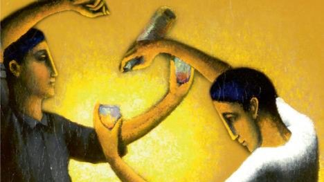

# Livre: Alexis Zorba

Édition: 1
Date l'événement: 2022-03-05T17:00:00+01:00
Auteur: Nikos Kazantzaki
Année: 1946
Pays: Grèce

## Description
Pour la première rencontre du groupe, je vous propose de lire un classique intemporel de la littérature grecque et mondiale.

À travers l'histoire de la rencontre entre deux hommes, un jeune intellectuel désireux de sortir de ses livres pour se confronter au réel, et Zorba, un homme mûr, force de la nature animé par un élan vital impétueux, un être à la liberté souveraine, tous deux en partance pour la Crète où ils exploiteront ensemble une mine de lignite sous l'œil circonspect des villageois, Kazantzakis aborde des questionnements existentiels fondamentaux qui font écho à la destinée de l'auteur mais dont la portée est universelle.

https://www.placedeslibraires.fr/livre/9782330087173-alexis-zorba-nikos-kazantzaki/

Merci d'avoir lu le livre avant la rencontre! Nous partagerons nos impressions, sentiments et pensées autour d'un café et, à la fin de la séance, nous choisirons collectivement la prochaine lecture.
