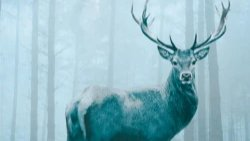

# Livre: Sur les ossements des morts

Édition: 50
Date l'événement: 2026-10-10
Lien: https://www.meetup.com/club-de-lecture-les-lectures-d-ailleurs/events/316537211/
Auteur: Olga Tokarczuk
Année: 2009
Pays: Pologne

## Description
Pour notre 50ème édition, nous découvrirons l'auteure polonaise Olga Tokarczuk, prix Nobel de littérature 2018, avec son roman *Sur les ossements des morts*.

Janina Doucheyko vit seule dans un petit hameau au coeur des Sudètes. Ingénieur à la retraite, elle se passionne pour la nature, l'astrologie et l'oeuvre de William Blake. Un matin, elle retrouve un de ses voisins mort dans sa cuisine, étouffé par un petit os. C'est le début d'une longue série de crimes mystérieux sur les lieux desquels on retrouve des traces animales. La police enquête. Les victimes avaient toutes pour la chasse une passion dévorante. Quand Janina Doucheyko s'efforce d'exposer sa théorie sur la question, tout le monde la prend pour une folle... Car comment imaginer qu'il puisse s'agir d'une vengeance des animaux ?

Merci d'avoir lu le livre avant la rencontre afin de partager vos impressions, sentiments et pensées. À la fin de la séance, nous choisirons collectivement la prochaine lecture et, pour ceux qui veulent, nous poursuivrons la discussion autour d’un petit dîner dans un restaurant.
