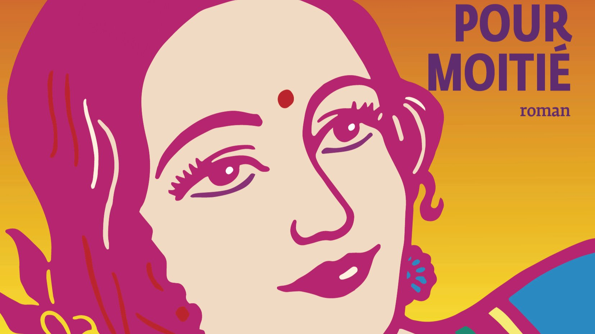

# Livre: Femme pour moitié

Édition: 36
Date l'événement: 2025-05-10T17:00:00+02:00
Auteur: Perumal Murugan
Année: 2010
Pays: Inde

## Description
Pour notre rencontre de mai, retour en Inde avec *Femme pour moitié* de l'auteur tamoul Perumal Murugan.

Dans un village modeste du Tamil Nadu, État du sud de l’Inde, Ponna et Kali, jeune couple de paysans, filent le parfait amour. Pourtant leur bonheur est mal vu car ils n’ont toujours pas conçu d’enfant. Ponna et Kali se sentent suffisamment comblés par leur union mais, face aux moqueries et humiliations croissantes, ils vont chercher une solution dans leur folklore, entre superstitions et offrandes. C’est alors qu’ils ont vent d’un festival dans un temple juché sur les montagnes, et d’une curieuse cérémonie qui pourrait peut-être les sauver…

Considéré de nos jours comme l’un des plus grands auteurs indiens, Perumal Murugan signe ici un roman fascinant qui décrit dans un superbe décor la force d’un amour atypique malmené par la rigueur des mœurs de l’Inde rurale. En osant aborder le tabou de l’infertilité dans le couple, *Femme pour moitié* a fait scandale dès sa parution, et a plongé l’auteur dans une grande tourmente.

Merci d'avoir lu le livre avant la rencontre afin de partager vos impressions, sentiments et pensées. À la fin de la séance, nous choisirons collectivement la prochaine lecture et pour, ceux qui veulent, nous poursuivrons la discussion autour d’un petit dîner dans un restaurant.
