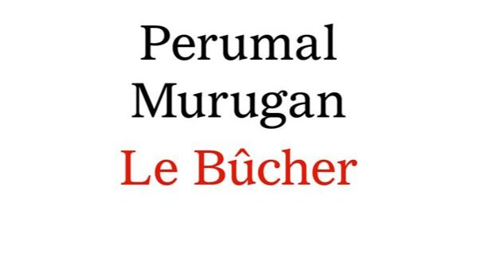

# Livre: Le bûcher

Édition: 7
Date l'événement: 2022-09-17T17:00:00+02:00
Auteur: Perumal Murugan
Année: 2013
Pays: Inde

## Description
Pour la septième rencontre et en ouverture de notre saison littéraire, voyage en Inde avec un roman de langue tamoul: *Le bûcher* de Perumal Murugan.

« Je ne sais pas de quelle caste tu es, mais fais bien attention avec ces gens. Tu ne peux pas compter sur ton mari pour te protéger. Ils attendront qu'il s'absente et, à la première occasion, ils en profiteront pour te chasser. Ils sont capables du pire. Prends garde.»

Après la mort de son père, Kumaresan quitte son village natal et se rend à la ville pour y trouver du travail. À l'usine, il met le soda en bouteille avant d'aller le livrer à vélo aux échoppes qui en font commerce. C'est là qu'il fait la rencontre de Saroja, et tout à coup, c'est l'amour fou. Mais c'est aussi un amour interdit : la jeune fille n'est pas issue de la même caste que lui. Avec la fougue de la jeunesse, ils se marient clandestinement dans un temple peu regardant sur l'origine sociale des mariés, avant de regagner ensemble le village de Kumaresan. Le jeune homme est persuadé qu'il finira par avoir raison des réticences des siens et par faire accepter sa femme. Mais dans ce petit village isolé du Tamil Nadu où les traditions pèsent comme une chape de plomb, le piège se referme sur eux, jour après jour.

Merci d'avoir lu le livre avant la rencontre ! Nous partagerons nos impressions, sentiments et pensées autour d'un café et, à la fin de la séance, nous choisirons collectivement la prochaine lecture.
