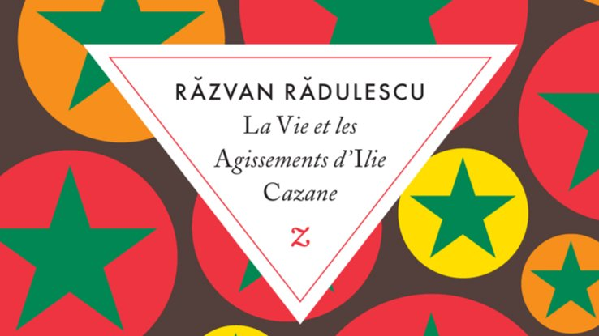

# Livre: La Vie et les Agissements d’Ilie Cazane

Édition: 20
Date l'événement: 2023-12-09T17:00:00+01:00
Auteur: Razvan Radulescu
Année: 1997
Pays: Roumanie

## Description
Pour notre dernier rendez-vous de l'année, nous découvrirons la littérature roumaine contemporaine avec le roman *La Vie et les Agissements d’Ilie Cazane* de Razvan Radulescu.

Ilie Cazane mènerait une existence plutôt paisible s’il n’avait le don extraordinaire de faire pousser des tomates géantes. Sous le régime du Conducator Ceausescu, pareil mystère passe pour un crime inconcevable.
Le colonel Chirita, esprit rationnel qui ne jure que par un matérialisme forcené, a vite fait de le mettre aux arrêts. Mais rien n’y fait : malgré les supplices, Cazane demeure muet et ses surnaturels talents de jardinier restent inexplicables…
Pendant ce temps-là, sa femme Georgette accouche d’un garçon : Ilie Cazane fils qui, avec sa grosse tête de courge, va vite montrer des penchants désopilants pour le bricolage et, en digne fils de son père, s’attirer la sympathie générale.
Entre la nature désinvolte et mystérieuse d’Ilie Cazane père, l’enfance burlesque d’Ilie Cazane fils et les questionnements métaphysiques du colonel Chirita, se déploie le spectacle d’une communauté à l’innocence joyeuse, en proie à un système paranoïaque et absurde.

Merci d'avoir lu le livre avant la rencontre afin de partager vos impressions, sentiments et pensées. À la fin de la séance, nous choisirons collectivement la prochaine lecture et pour, ceux qui veulent, nous poursuivrons la discussion autour d’un petit dîner.
