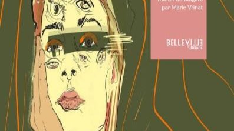

# Livre: Vierge jurée

Édition: 6
Date l'événement: 2022-07-23
Lien: https://www.meetup.com/club-de-lecture-les-lectures-d-ailleurs/events/286656407/
Auteur: Rene Karabash
Année: 2018
Pays: Bulgarie

## Description
Pour la sixième rencontre, découverte de la littérature bulgare avec un roman contemporain : *Vierge jurée* de Rene Karabash.

Ostaïnitsa - « vierge jurée » : femme qui fait serment de virginité et commence à mener une vie d'homme et de chef de famille dans des sociétés patriarcales au nord de l'Albanie, au Kosovo, en Macédoine, Serbie, Monténégro, Croatie, Bosnie - ces contrées où règne le kanun. C'est un changement de genre constitutionnellement admis par un serment qui, une fois prononcé, permet à la femme d'acquérir tous les droits d'un homme. De nos jours, il ne reste que quelques vierges jurées.

Tout cela se passe à seulement 537 kilomètres de la Bulgarie. Ce n'est ni un mythe ni un conte.
Dans ce roman puissant de Rene Karabash, on suit l'histoire de Bekia qui devient Matia. La vie de Bekia nous est dévoilée à travers son dialogue/monologue avec une journaliste venue réaliser un documentaire sur la dernière vierge jurée des Balkans. Bekia décide de devenir une vierge jurée après avoir été violée par l'idiot du village la veille de ses noces avec Nemania : ce dernier, découvrant qu'elle n'était pas « pure » aurait le droit de la tuer. Elle adopte le prénom masculin de Matia et renonce à la femme en elle. Par ce renoncement, elle entache l'honneur de celui qu'elle devait épouser et engage ainsi sa famille dans l'une de ces vendettas qui font partie du quotidien des habitants de ces contrées...

https://www.placedeslibraires.fr/livre/9782493823007-vierge-juree-rene-karabash/

Merci d'avoir lu le livre avant la rencontre ! Nous partagerons nos impressions, sentiments et pensées autour d'un café et, à la fin de la séance, nous choisirons collectivement la prochaine lecture.
