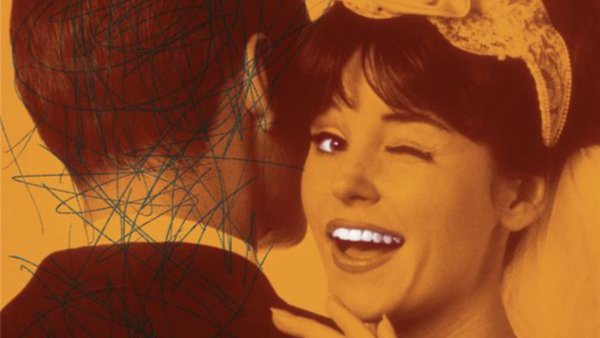

# Livre: Mon cher mari

Édition: 9
Date l'événement: 2022-11-19T17:00:00+01:00
Auteur: Rumena Bužarovska
Année: 2014
Pays: Macédoine du Nord

## Description
Retour aux Balkans pour cette neuvième rencontre du groupe, avec un recueil de nouvelles de l'auteure Macédonienne Rumena Buzarovska: *Mon cher mari*.

À tour de rôle, onze femmes se livrent sans tabou au sujet de leur époux. Adultère ou machiste, prétentieux ou destructeur, l'homme de chaque couple est décrit par sa compagne dans une situation quotidienne qui dévoile l'étendue de ses défauts, mais également à quel point il est difficile de vivre à deux. Car parler de son conjoint, c'est forcément révéler autant sur soi que sur l'autre...Tableau à la fois désopilant et terrible des rôles attribués par la société, Mon cher mari renouvelle la fiction féministe en égratignant tout le monde. Sur un fil d'équilibriste entre ironie décapante et tragique de la banalité conjugale, Rumena Bužarovska pointe les limites sociales comme intimes de notre discours sur le couple et interroge de son irrésistible talent chaque rouage du vaste jeu de l'amour et du mariage.

https://www.placedeslibraires.fr/livre/9782072951770-mon-cher-mari-rumena-bu-arovska/

Merci d'avoir lu le livre avant la rencontre afin de partager vos impressions, sentiments et pensées. A la fin de la séance, nous choisirons collectivement la prochaine lecture et pour, ceux qui veulent, nous poursuivrons la discussion autour d’un petit dîner.
