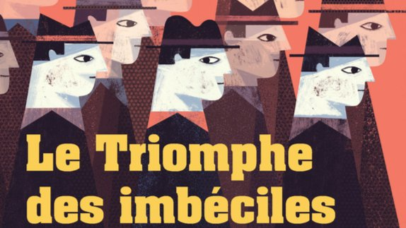

# Livre: Le Triomphe des imbéciles

Édition: 27
Date l'événement: 2024-07-20
Lien: https://www.meetup.com/club-de-lecture-les-lectures-d-ailleurs/events/301810721/
Auteur: Samir Kacimi
Année: 2020
Pays: Algérie

## Description
Pour notre prochaine rencontre, destination l'Algérie avec *Le Triomphe des imbéciles* de Samir Kacimi, auteur algérien contemporain qui écrit en arabe.

Le président algérien a fait un cauchemar. L’ensemble des habitants est immédiatement convoqué pour que soient identifiés – et mis hors d’état de nuire – les premiers rôles de ce songe menaçant. Commence alors un jeu de massacre jubilatoire, qui fait la part belle aux personnages les plus burlesques d’un quartier historique de la capitale, déterminés à profiter de la bêtise ambiante pour s’adonner aux pires combines. Jusqu’à un revers magistral : une étrange épidémie touche le pays et tous, des plus puissants aux plus démunis, perdent leur capacité à lire et à écrire. Qui faudra-t-il hisser au pouvoir pour les gouverner ?
Inertie politique, réseaux sociaux aussi abrutissants que dangereux, organes étatiques gangrénés, corruption à tous les étages, population qui a perdu le sens de l’insoumission – l’auteur livre ici une radiographie saisissante, ravageuse, d’une société qui semble avoir basculé de l’autre côté du miroir, à l’image, peut-être, de notre monde tout entier.

Merci d'avoir lu le livre avant la rencontre afin de partager vos impressions, sentiments et pensées. À la fin de la séance, nous choisirons collectivement la prochaine lecture et pour, ceux qui veulent, nous poursuivrons la discussion autour d’un petit dîner.
