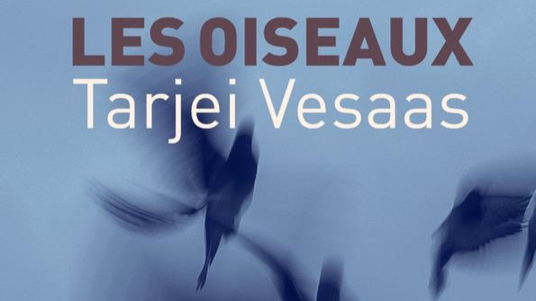

# Livre: Les oiseaux

Édition: 8
Date l'événement: 2022-10-23T17:00:00+02:00
Auteur: Tarjei Vesaas
Année: 1957
Pays: Norvège

## Description
Pour ce début d’automne, nous découvrirons un grand roman de la littérature norvégienne : *Les oiseaux* de Tarjei Vesaas.

Roman du sensible et éloge de la différence, le texte de Tarjei Vesaas est l'un des grands chefs-d’œuvre de la littérature du XXe siècle. Parce qu'il vous entraîne inexorablement à l'intérieur de vous-même, *Les Oiseaux* se révèle comme le grand livre du bouleversement.

Dans *Les Oiseaux*, Tarjei Vesaas, un des plus grands écrivains norvégiens, raconte l'histoire de Mattis, simple d'esprit au cœur vierge et à l'âme candide que la dureté du monde réel a définitivement refoulé dans un univers de rêves.
Ce roman poignant invite le lecteur à mieux aimer la vie, à apprendre à dépasser, à transfigurer les contingences : la nature, la simplicité, l'évidente et immédiate beauté d'un lac, d'une forêt, d'une aile d'oiseau, d'un regard de jeune fille en sont l'irréfutable preuve. Ils sont au-delà du malheur et de la mort et leur miracle ne périt jamais, il est à la portée du plus déshérité.

[https://www.placedeslibraires.fr/livre/9782366246148-les-oiseaux-tarjei-vesaas/](https://www.placedeslibraires.fr/livre/9782366246148-les-oiseaux-tarjei-vesaas/)

Merci d'avoir lu le livre avant la rencontre afin de partager vos impressions, sentiments et pensées. A la fin de la séance, nous choisirons collectivement la prochaine lecture et pour, ceux qui veulent, nous poursuivrons la discussion autour d’un petit dîner.
