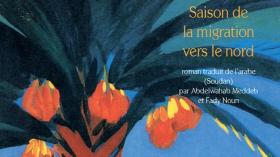

# Livre: Saison de la migration vers le nord

Édition: 40
Date l'événement: 2025-10-11T17:00:00+02:00
Auteur: Tayeb Salih
Année: 1966
Pays: Soudan

## Description
Pour notre 40ème rencontre, nous lirons un classique de la littérature arabe: *Saison de la migration vers le nord* de l'auteur soudanais Tayeb Salih.

Au jeune étudiant rentré au pays après un séjour en Europe, Moustafa Saïd entreprend de raconter son histoire : celle d´un destin déchiré entre la vie immémoriale de l´Afrique et le mouvement de l´Occident. Moustafa Saïd en effet à passé de nombreuses années en Angleterre, où il à mené des études brillantes, séduit de nombreuses femmes, provoqué le suicide de deux d´entre elles, brisé le mariage d´une autre... Sur sa vie plane une ombre de mystère. Peu de temps après son récit, inachevé, il meurt noyé dans le Nil, alors qu'il était excellent nageur : son confident tentera dès lors de remonter le cours d'une vie complexe, de comprendre qui fut réellement le fascinant Moustafa Saïd, et c'est avec une science dramatique extrême que l'auteur distille les éléments de cette envoûtante enquête.

Merci d'avoir lu le livre avant la rencontre afin de partager vos impressions, sentiments et pensées. À la fin de la séance, nous choisirons collectivement la prochaine lecture et pour, ceux qui veulent, nous poursuivrons la discussion autour d’un petit dîner dans un restaurant.
