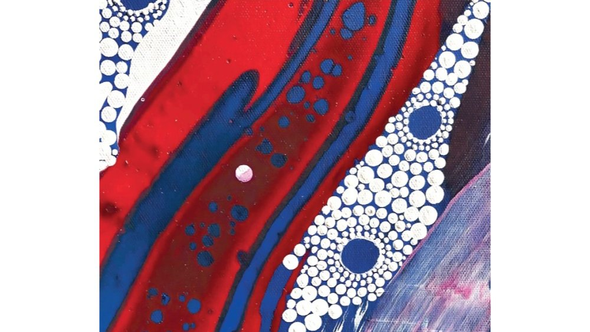

# Livre: La Petite Fille blanche

Édition: 45
Date l'événement: 2026-03-21
Lien: https://www.meetup.com/club-de-lecture-les-lectures-d-ailleurs/events/313473392/
Auteur: Tony Birch
Année: 2019
Pays: Australie

## Description
Pour notre prochaine rencontre, nous lirons notre premier roman traduit de l’anglais afin de découvrir un auteur aborigène et la littérature australienne : *La Petite Fille blanche* de Tony Birch.
(Pour ceux qui ont assisté à la dernière rencontre et seront étonnés par ce choix, je vous informe que malheureusement nous avons dû abandonner le livre estonien convenu car apparemment il n’est plus disponible en vente et il serait trop difficile d’en trouver un exemplaire. Je suis désolée de ce changement qui n’a pas pu être validé par tous les participants.)
Odette Brown a passé toute sa vie en périphérie de Deane, une petite ville rurale australienne. Sa fille Lila a disparu sans jamais revenir, lui abandonnant la petite Sissy, âgée d’un an. Pendant treize ans, Odette a réussi à élever sa petite-fille discrètement, évitant l’attention des services sociaux qui enlèvent les enfants aborigènes à la peau claire à leur famille. Mais l’arrivée en ville d’un nouveau policier zélé, bien décidé à faire respecter la loi à la lettre, perturbe la vie des Brown. Odette devra faire preuve de courage et de ruse pour protéger Sissy des autorités tout en tentant de retrouver sa fille.
Dans cette fuite à travers l’Australie des années 60, le plus grand conteur indigène australien d’aujourd’hui nous offre un roman immersif et d’une profonde humanité, qui explore les limites que nous sommes prêts à franchir pour protéger ceux que nous aimons.
Tony Birch est universitaire, militant aborigène et l’un des auteurs les plus populaires d’Australie. Son roman *La Petite Fille blanche* a reçu le « Prix des écrivains indigènes » au prestigieux New South Wales Premier’s Literary Awards. C’est son deuxième livre à paraître en français après *Du même sang* (Mercure de France, 2016).
Merci d'avoir lu le livre avant la rencontre afin de partager vos impressions, sentiments et pensées. À la fin de la séance, nous choisirons collectivement la prochaine lecture et pour, ceux qui veulent, nous poursuivrons la discussion autour d’un petit dîner dans un restaurant.
