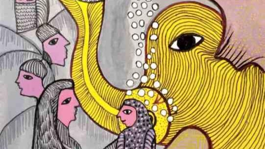

# Livre: Grand-père avait un éléphant

Édition: 18
Date l'événement: 2023-10-14
Lien: https://www.meetup.com/club-de-lecture-les-lectures-d-ailleurs/events/296158945/
Auteur: Vaikom Muhammad Basheer
Année: 1951
Pays: Inde

## Description
Pour notre prochaine rencontre, nous retrouvons la littérature indienne, avec un livre écrit en malayam, la langue du Kerala: *Grand-père avait un éléphant* de Vaikom Muhammad Basheer.

Du monde, la jeune et jolie Kounnioupattoumma ne sait rien, si ce n'est que son grand-père avait un éléphant ! Fille de notables musulmans, elle est en âge d'être mariée. Mais pour sa mère, les prétendants ne sont jamais assez beaux, jeunes, riches, puissants... Surtout quand on songe à la splendeur passée du grand-père à l'éléphant.

Hélas, voilà la famille ruinée. Adieu vaste demeure, domestiques, bijoux en or ! Kounnioupattoumma peut enfin goûter aux délices de la baignade en attendant des jours meilleurs...

Avec un profond amour des êtres, qu'il ne désespère pas d'éduquer et de distraire, Basheer mêle à la perfection vérité et humour.

https://www.placedeslibraires.fr/livre/9782843049446-grand-pere-avait-un-elephant-vaikom-muhammad-basheer/

Merci d'avoir lu le livre avant la rencontre afin de partager vos impressions, sentiments et pensées. À la fin de la séance, nous choisirons collectivement la prochaine lecture et pour, ceux qui veulent, nous poursuivrons la discussion autour d’un petit dîner.
