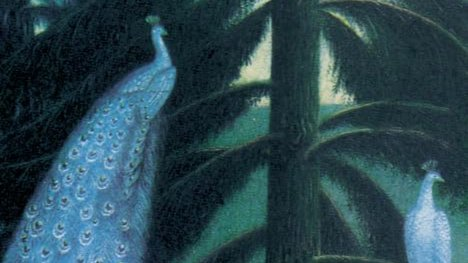

# Livre: Parfum de glace

Édition: 21
Date l'événement: 2024-01-27
Lien: https://www.meetup.com/club-de-lecture-les-lectures-d-ailleurs/events/297863786/
Auteur: Yoko Ogawa
Année: 1998
Pays: Japon

## Description
Nous poursuivons en 2024 nos découvertes littéraires avec un voyage au Japon et le roman *Parfum de glace* de Yoko Ogawa.

A la mort de son compagnon, Ryoko réalise qu’elle ne savait rien de lui. Le jeune homme s’est suicidé dans son laboratoire de parfumeur, où il créait des fragrances exceptionnelles en combinant son incomparable mémoire olfactive à ses capacités scientifiques. Sur les lieux du drame, Ryoko trouve une disquette contenant quelques phrases énigmatiques. Incapable de faire le deuil de cet homme étrange, elle part à la rencontre de son passé.

Entre réel et imaginaire, symbolique et inconscient, Yoko Ogawa atteint ici le coeur des êtres, la source de leur mémoire, pour exprimer l’indicible douleur de vivre.

Merci d'avoir lu le livre avant la rencontre afin de partager vos impressions, sentiments et pensées. À la fin de la séance, nous choisirons collectivement la prochaine lecture et pour, ceux qui veulent, nous poursuivrons la discussion autour d’un petit dîner.
